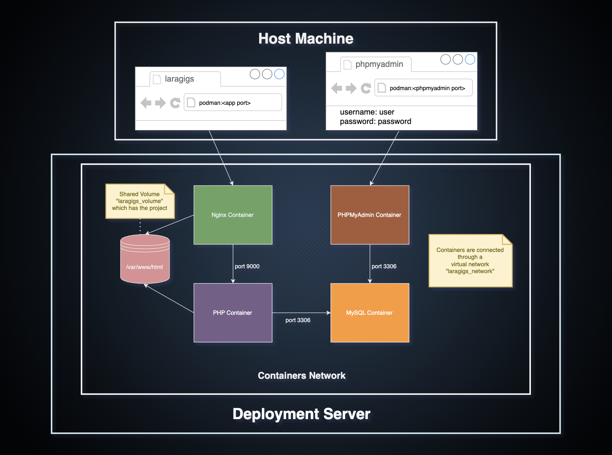

# Laragigs

Laragigs is a web application built with Laravel for managing job posts. The application includes authentication functionality, allowing users to create accounts for post creation and management. Even without logging in, users can search for job posts based on various criteria.

## Features

-   User authentication system for account creation and post management.
-   CRUD (Create, Read, Update, Delete) functionality for job posts.
-   Search functionality for posts based on titles, descriptions, tags, location, and company.
-   Detailed view for each job post, providing comprehensive information.

## Deployment

Laragigs can be deployed using containers. The provided containers include:

-   MySQL: Database storage for the application.
-   PHPMyAdmin: Web-based database management tool.
-   PHP: Server-side scripting language for the Laravel application.
-   Nginx: Web server to handle HTTP requests.

For detailed instructions on building and deploying the application, refer to the following files:

-   [build-and-deploy.md](build-and-deploy.md) for deployment instructions.
-   [commands.md](commands.md) for the necessary commands to execute the containers.

## Containers Diagram

